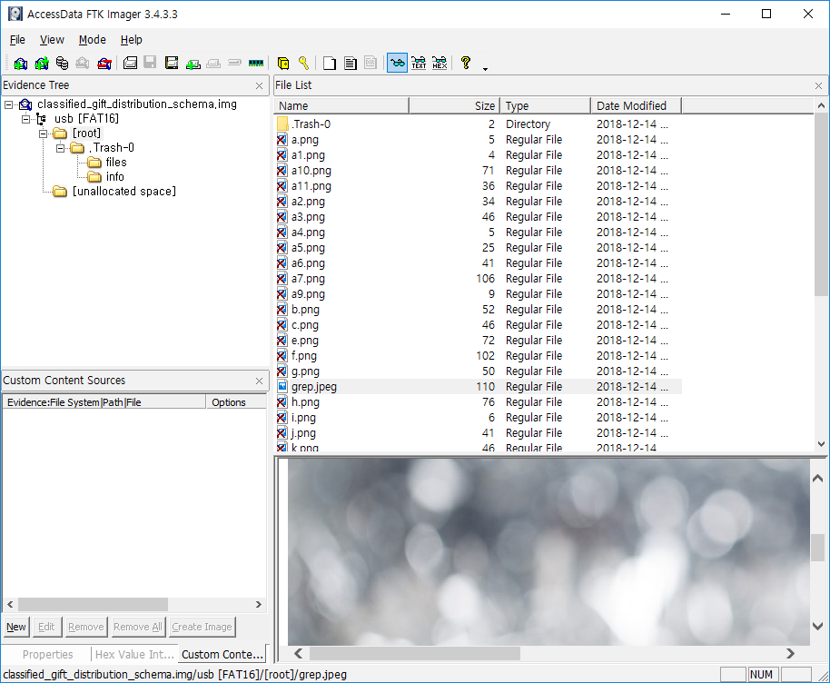
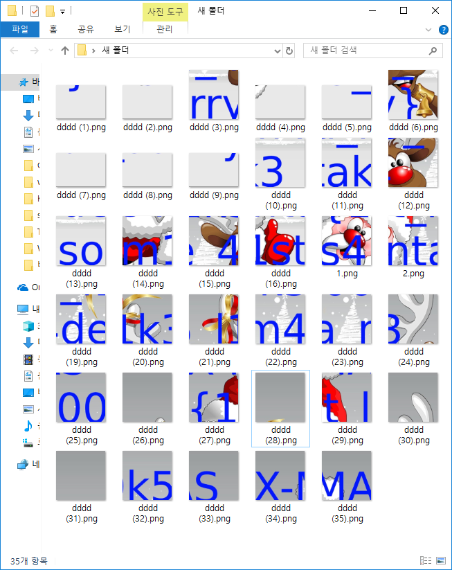
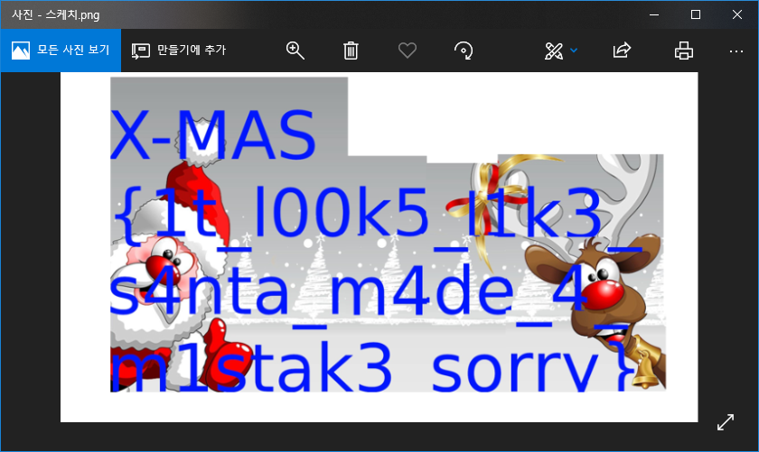

# Message from Santa

## Challenge Description

50
Santa prepared a flag for you. Unfortunately, he has no idea where he left it. Finders keepers.

classified_gift_distribution_schema.img

Author: Googal

## Solution

### Starting Point

If we use `file` command in linux shell to the provided file, we can find out that file is a FAT filesystem disk image. I usually analyse disk images with [FTK Imager](http://marketing.accessdata.com/ftkimager3.2.0), so I'll go through with it. You can download it freely in offical website.

```shell
$ file classified_gift_distribution_schema.img
classified_gift_distribution_schema.img: DOS/MBR boot sector, code offset 0x3c+2, OEM-ID "mkfs.fat", sectors/cluster 4, reserved sectors 4, root entries 512, sectors 20480 (volumes <=32 MB), Media descriptor 0xf8, sectors/FAT 20, sectors/track 62, heads 63, hidden sectors 2048, serial number 0x75b1a735, label: "usb
", FAT (16 bit)
```

### Inside the Disk Image



Inside disk image, we can find record of a lot of image files being deleted. And you can still recover it from `Recycle Bin`. Just right-click the file you want to recover and press `Export to get it out in the desktop.



So, now we have bunch of image pieces which we presume that it broke apart intentionally. All we have to do is just reassemble it! I had some free time in my workplace, so I kinda like played with these. Easy Forensic Questionare, isn't it?

