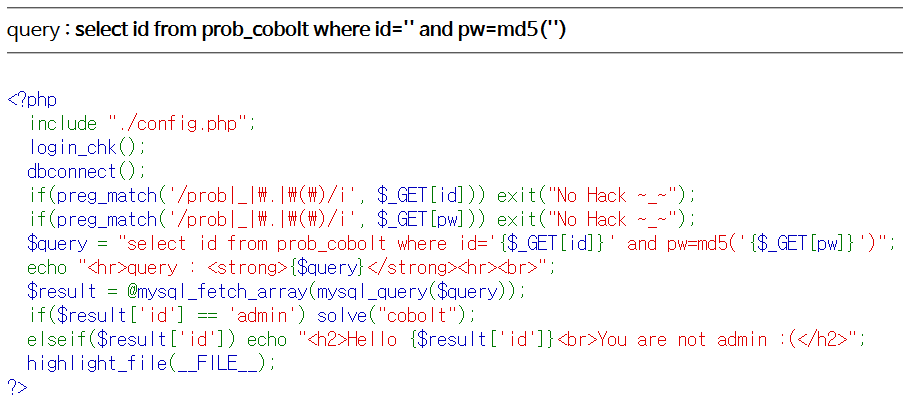

# Level 2 - Cobolt

## 문제



## 문제 의도

- php 소스를 읽을 줄 아는가?
- 간단한 SQLi를 사용해 원하는 레코드를 받아올 수 있는가?

## 코드 분석

```php
<?php
  include "./config.php";
  login_chk();
  dbconnect();
  if(preg_match('/prob|_|\.|\(\)/i', $_GET[id])) exit("No Hack ~_~");
  if(preg_match('/prob|_|\.|\(\)/i', $_GET[pw])) exit("No Hack ~_~");
  $query = "select id from prob_cobolt where id='{$_GET[id]}' and pw=md5('{$_GET[pw]}')";
  /* GET으로 받은 pw 필드의 MD5 해쉬 값을 where 조건문에 넣었다.
     코드에서 부터 문제 푸는 데 pw필드를 사용할 생각을 하지 말아라
     라고 하는 것 같다. */
  echo "<hr>query : <strong>{$query}</strong><hr><br>";
  $result = @mysql_fetch_array(mysql_query($query));
  if($result['id'] == 'admin') solve("cobolt");
  /* 쿼리 결과를 받은 result 변수의 id 필드의 값이 'admin'일때 solve()
     함수가 호출된다. */
  elseif($result['id']) echo "<h2>Hello {$result['id']}<br>You are not admin :(</h2>";
  highlight_file(__FILE__);
?>
```

## 문제 풀이

문제의 목적은 result변수의 id 필드 값이 'admin'이어야 한다. id 필드에 **admin‘ -- -** 을 넣으면 쿼리문의 id 필드에 admin이 들어가게 되고 **--** 로 pw를 검증하는 where 조건문이 주석처리 되기 때문에 pw 검증을 우회할 수 있다. 그래서 id 필드가 admin인 레코드를 조회하는 쿼리문이 되어서 해당 레코드를 반환하게 된다.


