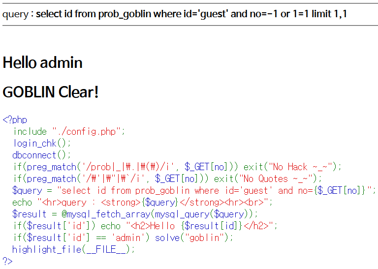

# Level 3 - Goblin

## 문제


## 문제 의도

- php 소스를 읽을 줄 아는가?
- quote, double quote, backquote 필터링을 우회할 수 있는가?

## 코드 분석

```php
<?php
  include "./config.php";
  login_chk();
  dbconnect();
  if(preg_match('/prob|_|\.|\(\)/i', $_GET[no])) exit("No Hack ~_~");
  if(preg_match('/\'|\"|\`/i', $_GET[no])) exit("No Quotes ~_~");
  /* 만약 GET으로 받은 no 필드에 ' (single quote), " (double quote),
     ` (backquote) 같은 특수문자가 있으면 exit() 함수가 호출된다.
     쿼리를 만들 때 Quote를 제한하려는 의도로 보인다. */
  $query = "select id from prob_goblin where id='guest' and no={$_GET[no]}";
  echo "<hr>query : <strong>{$query}</strong><hr><br>";
  $result = @mysql_fetch_array(mysql_query($query));
  if($result['id']) echo "<h2>Hello {$result[id]}</h2>";
  if($result['id'] == 'admin') solve("goblin");
  highlight_file(__FILE__);
?>
```

## 문제 풀이

코드에 있는 쿼리에 Where Clause의 id 필드가 guest로 하드코딩 되어있는데 이걸 어떻게 바꿀까 부터 문제를 접근했었는데, 지금 생각해보면 그동안 배운 SQL Injection을 생각해 보지 않았던 것 같았다. 일단 GET방식으로 받는 no 필드를 쿼리에 넣을 때 Quote가 양 옆에 붙어있지 않으므로 뒤에 SQL문을 더 붙일 수 있다.

no 필드엔 아무거나 넣고 뒤에 **or 1=1** 을 추가한다. 논리 연산을 수행할 때 or 연산은 and 연산보다 우선순위가 낮으므로, 쿼리하는 레코드의 id 필드가 guest가 아니어도 뒤의 or 연산 때문에 id를 구분하려는 where 조건문이 무력화 된다. 이제 다시 id가 admin인 레코드를 쿼리하는 where 문을 뒤에 붙이면 되는데, 하필이면 Quote를 못써서 and id='admin'을 사용할 수 없다.

### 방법 1

수업시간에 친구들의 다양한 해법들을 볼 수 있었는데, 그중 가장 기억 남는 건 limit를 사용한 방법이었다. 쿼리 뒤에 or 1=1를 추가하면 모든 레코드를 쿼리 하게 되는데, result에 값을 넣을 때 mysql_fetch_array() 함수는 맨 처음 레코드를 넣는다고 한다. 그래서 만약 저 쿼리문에 **limit**를 줘서 0번째 레코드를 무시하고 다음 레코드를 반환하게 한다면, guest가 아닌 다른 id의 계정이 나온다고 한다. 실제로 해본 결과 guest 다음 레코드는 admin 이어서 result 변수에 admin이 들어가게 되었다.

