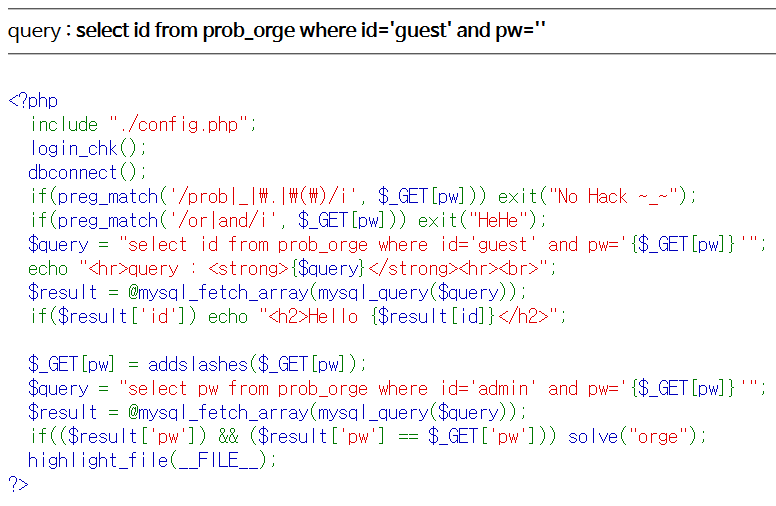
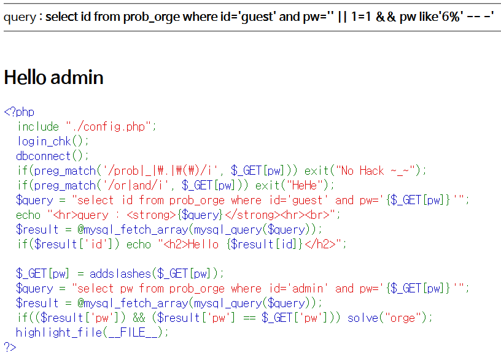

# Level 7 - Orge

## 문제



## 문제 의도

- php 소스를 읽을 줄 아는가?
- Or, And 연산자가 필터링 되었을 때 Blind SQLi를 수행할 수 있는가?

## 코드 분석

```php
<?php
  include "./config.php";
  login_chk();
  dbconnect();
  if(preg_match('/prob|_|\.|\(\)/i', $_GET[pw])) exit("No Hack ~_~");
  if(preg_match('/or|and/i', $_GET[pw])) exit("HeHe");
  $query = "select id from prob_orge where id='guest' and pw='{$_GET[pw]}'";
  echo "<hr>query : <strong>{$query}</strong><hr><br>";
  $result = @mysql_fetch_array(mysql_query($query));
  if($result['id']) echo "<h2>Hello {$result[id]}</h2>";

  $_GET[pw] = addslashes($_GET[pw]);
  $query = "select pw from prob_orge where id='admin' and pw='{$_GET[pw]}'";
  $result = @mysql_fetch_array(mysql_query($query));
  if(($result['pw']) && ($result['pw'] == $_GET['pw'])) solve("orge");
  highlight_file(__FILE__);
?>
```

## 문제 풀이

Level 4의 Blind-SQL 기법과 Level 6에서 Or, And 연산자가 차단 되었을때 SQLi를 수행하는 방법을 합치면 된다. Level 4에서 넣은 SQL문은 ' or 1=1 and pw like '' -- - 으로 1=1로 모든 레코드를 조회하되 pw 필드가 LIKE문에 충족하는 레코드만 쿼리한다. 여기선 Or과 And을 필터링 하므로 각각 || 과 %26%26(&&)로 치환한다.



열심히 노가다를 뛴 결과 pw 필드 값은 6c864dec임을 알아 낼 수 있었다. (반성해야겠다..)

