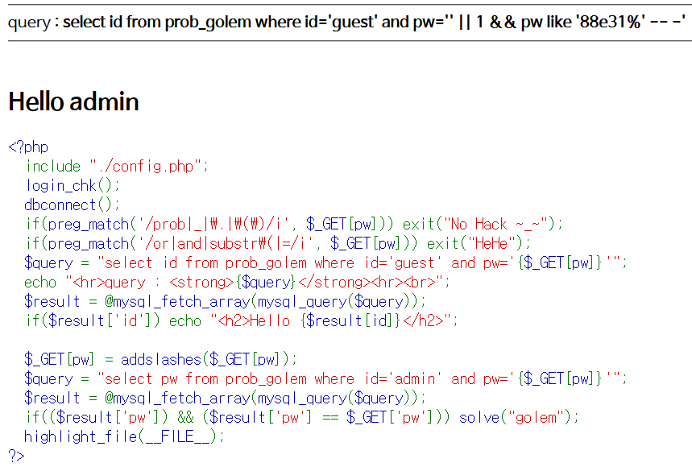
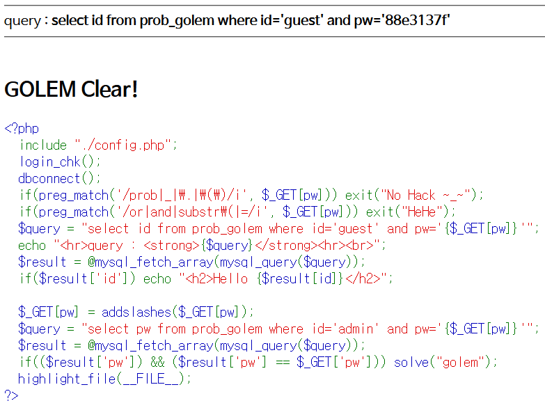

# Level 11 - Golem

## 문제


## 문제 의도

- php 소스를 읽을 줄 아는가?
- Or, And, Substr, = 연산자가 필터링 되었을 때 Blind SQLi를 수행할 수 있는가?

## 코드 분석

```php
<?php
  include "./config.php";
  login_chk();
  dbconnect();
  if(preg_match('/prob|_|\.|\(\)/i', $_GET[pw])) exit("No Hack ~_~");
  if(preg_match('/or|and|substr\(|=/i', $_GET[pw])) exit("HeHe");
  /* or, and, substr, = 연산자를 필터링한다. */
  $query = "select id from prob_golem where id='guest' and pw='{$_GET[pw]}'";
  echo "<hr>query : <strong>{$query}</strong><hr><br>";
  $result = @mysql_fetch_array(mysql_query($query));
  if($result['id']) echo "<h2>Hello {$result[id]}</h2>";

  $_GET[pw] = addslashes($_GET[pw]);
  $query = "select pw from prob_golem where id='admin' and pw='{$_GET[pw]}'";
  $result = @mysql_fetch_array(mysql_query($query));
  if(($result['pw']) && ($result['pw'] == $_GET['pw'])) solve("golem");
  highlight_file(__FILE__);
?>
```

## 문제 풀이

이 문제도 필터링 하는게 많지 않아서 쉽게 풀 수 있었는데, 일단 pw 필드에 **' or 1**로 모든 레코드를 가져온다음, **and pw like** 문으로 pw를 한글자씩 맞추어 나가면 된다. 여기서 or과 and를 필터링 하기 때문에 or은 || 로, and는 %26%26으로 바꾸면 된다.


열심히 노가다를 뛴 결과, pw는 '88e3137f'임을 알아낼 수 있었다.

