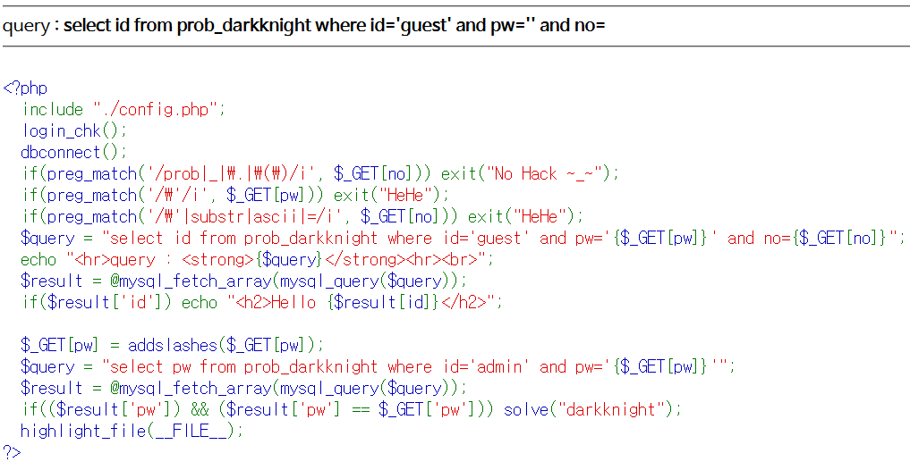
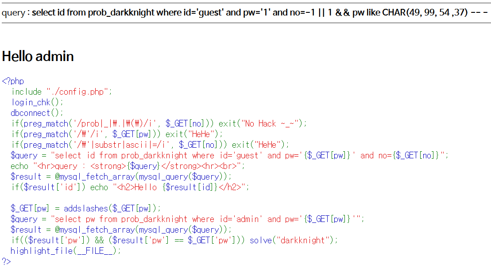
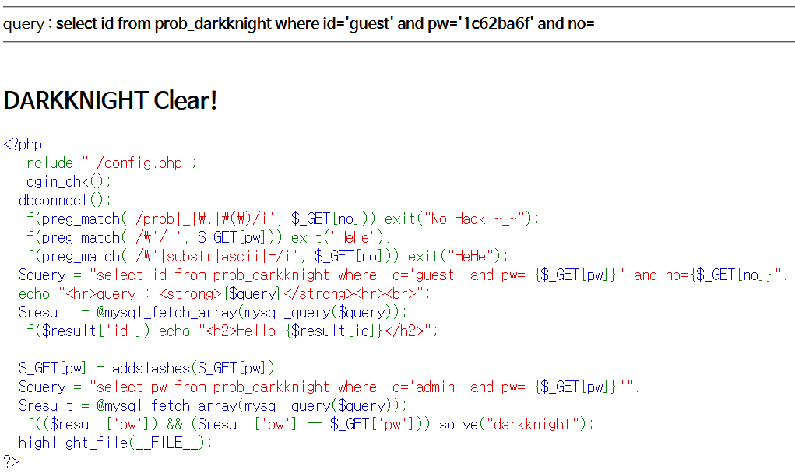

# Level 12 - Darkknight

## 문제



## 문제 의도

- php 소스를 읽을 줄 아는가?
- Single Quote('), substr, ascii, = 연산자가 필터링 되었을 때 Blind SQLi를 수행할 수 있는가?

## 코드 분석

```php
<?php
  include "./config.php";
  login_chk();
  dbconnect();
  if(preg_match('/prob|_|\.|\(\)/i', $_GET[no])) exit("No Hack ~_~");
  if(preg_match('/\'/i', $_GET[pw])) exit("HeHe");
  /* GET으로 받은 pw 필드에서 Single Quote를 필터링 한다 */
  if(preg_match('/\'|substr|ascii|=/i', $_GET[no])) exit("HeHe");
  /* GET으로 받은 no 필드에서 substr, ascii, =, Single Quote를 필터링 한다.*/
  $query = "select id from prob_darkknight where id='guest' and pw='{$_GET[pw]}' and no={$_GET[no]}";
  echo "<hr>query : <strong>{$query}</strong><hr><br>";
  $result = @mysql_fetch_array(mysql_query($query));
  if($result['id']) echo "<h2>Hello {$result[id]}</h2>";

  $_GET[pw] = addslashes($_GET[pw]);
  $query = "select pw from prob_darkknight where id='admin' and pw='{$_GET[pw]}'";
  $result = @mysql_fetch_array(mysql_query($query));
  if(($result['pw']) && ($result['pw'] == $_GET['pw'])) solve("darkknight");
  highlight_file(__FILE__);
?>
```

## 문제 풀이

전 단계인 Level 11 문제와 Single Quote를 필터링 한다는 점이 다르다. Single Quote를 필터링 하면 LIKE 문을 사용할때 Single Quote로 감싼 문자열을 쓸수 없다. 이에 따라 CHAR() 함수를 사용해 Single Quote 없이도 문자열을 넣을 수 있도록 했다. CHAR() 함수는 SQL문에서 해석되서 인수로 받은 10진수 값들을 문자열로 합쳐 변환한다.
> e.g. CHAR(49, 99, 54, 37) => '1c6%'

Single Quote가 없는 no 필드에 아무 값이나 넣은 후 **|| 1** 으로 모든 레코드를 쿼리한 후, **%26%26 pw like CHAR() -- -** 로 관리자의 pw를 알아내면 된다.



끝없는 노가다 끝에 admin의 pw필드 값은 **'1c62ba6f'** 임을 알아낼 수 있었다.


