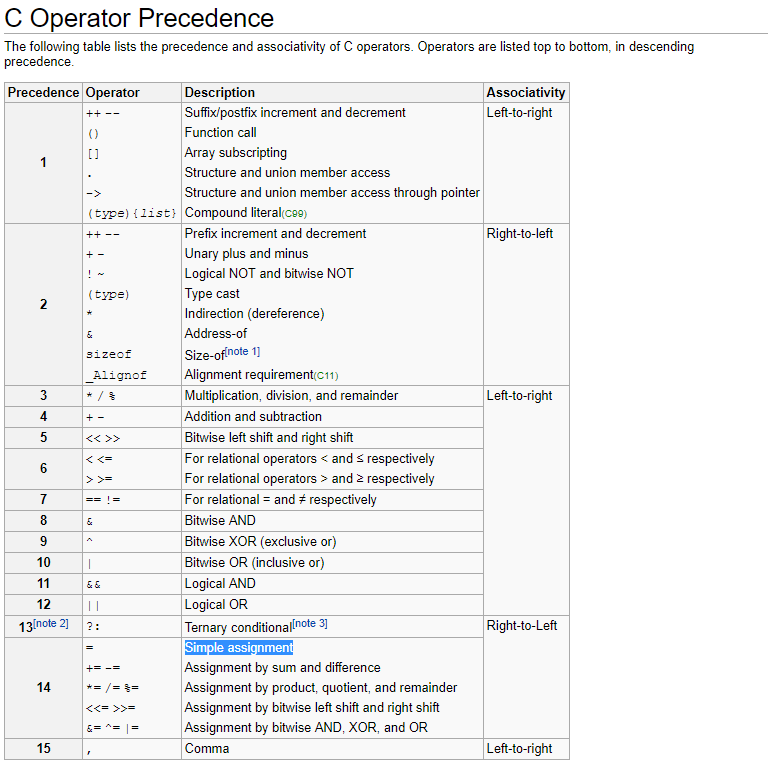

# mistake - 1 pt

```text
We all make mistakes, let's move on.
(don't take this too seriously, no fancy hacking skill is required at all)

This task is based on real event
Thanks to dhmonkey

hint : operator priority

ssh mistake@pwnable.kr -p2222 (pw:guest)
```

## 대체 무슨 실수길래 구경이나 하자

```c
mistake@ubuntu:~$ cat mistake.c
#include <stdio.h>
#include <fcntl.h>

#define PW_LEN 10
#define XORKEY 1

void xor(char* s, int len){
        int i;
        for(i=0; i<len; i++){
                s[i] ^= XORKEY;
        }
}

int main(int argc, char* argv[]){

        int fd;
        if(fd=open("/home/mistake/password",O_RDONLY,0400) < 0){
                printf("can't open password %d\n", fd);
                return 0;
        }

        printf("do not bruteforce...\n");
        sleep(time(0)%20);

        char pw_buf[PW_LEN+1];
        int len;
        if(!(len=read(fd,pw_buf,PW_LEN) > 0)){
                printf("read error\n");
                close(fd);
                return 0;
        }

        char pw_buf2[PW_LEN+1];
        printf("input password : ");
        scanf("%10s", pw_buf2);

        // xor your input
        xor(pw_buf2, 10);

        if(!strncmp(pw_buf, pw_buf2, PW_LEN)){
                printf("Password OK\n");
                system("/bin/cat flag\n");
        }
        else{
                printf("Wrong Password\n");
        }

        close(fd);
        return 0;
}
```

## 엥 어떤 문제라도?

겉으로만 보면 접근 제한된 `password` 파일에서 10바이트 읽어와 `pw_buf`에 저장하고, 사용자로부터 입력받아서 `pw_buf2`에 저장후 `1`과 XOR 한 다음 `strncmp`함수로 안전하게 비교하는 걸로 보인다. 뭐 이건 `password`파일에서 읽어오는 10바이트를 브루트포스 대입 공격 하지 않는 이상 풀 방법이 없어보이는데... 그런데 그 마저도 `sleep(time(0)%20)`으로 한번 실행할때 최대 20초 이상 실행을 지연시키니까 현실적으로 어려워 보인다.

이걸 어떻게 하지...라고 생각한 순간... _(사실 순간은 아니고 몇 십분 정도 삽질했음)_

## 연산자 우선순위



위의 그림은 [이 곳](http://en.cppreference.com/w/c/language/operator_precedence)에서 캡처해온 C언어의 연산자 우선순위이다. 이 표를 참고하고 코드를 다시보자.

```c
if(fd=open("/home/mistake/password",O_RDONLY,0400) < 0){
        printf("can't open password %d\n", fd);
        return 0;
}
```

다음 코드의 실행 순서를 생각해 보자.

function call을 의미하는 `()` 괄호묶음은 최우선순위로 먼저 실행이 된다.

1. `open("/home/mistake/password",O_RDONLY,0400)`

사실 그 다음, `=` 할당할 때 쓰는 연산자와 `<` 크기 비교연산자의 우선순위에서 문제가 발생한다. 코드를 작성한 사람은 `open`함수의 리턴값이 `fd` 변수에 먼저 대입되고, 그 다음 비교 연산을 수행해 `open`함수의 오류를 검출하려고 했을 것이다. 그러나, 비교 연산자 `<`의 우선순위가 대입 연산자 `=`보다 높기 때문에 비교 연산이 먼저 수행된다.

2. `open("/home/mistake/password",O_RDONLY,0400) < 0`

`open`함수의 반환값인 열린 파일의 디스크립터는 0보다 작은지 비교하는 비교 연산을 먼저 수행하게 된다. 작다는 의미는 파일 디스크립터가 정상적으로 할당되지 않음, 즉 `open`함수에 에러가 발생했다는 뜻이고 0보다 크단 의미는 `open`함수가 정상적으로 처리되고 파일 디스크립터가 할당됨을 의미한다.

정상적으로 파일이 열렸다면 파일 디스크립터는 당연히 0보다 클것이다. 이때 0보다 작은지 비교연산을 하게 되면 결과값은 `FALSE`, 0이 된다.

3. `fd = 0` ?????????

`fd`에 파일 디스크립터가 들어가길 바랬는데 예상치 못하게 `STDIN`스트림을 의미하는 0이 들어갔다.

그럼 이후에 `fd`가 가르키는 파일에서 데이터를 읽어오는 `read`함수는 파일이 아니라 `STDIN`에서 읽어오게 된다. 확실히 프로그래머가 의도하지 않은 동작이다.

```c
if(!(len=read(fd,pw_buf,PW_LEN) > 0)){
        printf("read error\n");
        close(fd);
        return 0;
}
```

## 결국 이 의미는...?

`/home/mistake/password`에서 읽어오려고 했던 비밀 값은 사실 `STDIN`에서 입력을 받아서 사용하게 된 것이다. 그러므로 입력값을 잘 활용하면 `pw_buf`와 `pw_buf2`를 같게 만들수 있다.

## 드디어... ㅎ으흐으흐그ㅡㅇㄱㅎ

```text
mistake@ubuntu:~$ ./mistake
do not bruteforce...
cccccccccc
input password : bbbbbbbbbb
Password OK
Mommy, the operator priority always confuses me :(
```

삽질 끝에 알게 되었다...

저렇게 예쁜 코드를 만들려다간 역통수를 맞을수 있다는 것을...