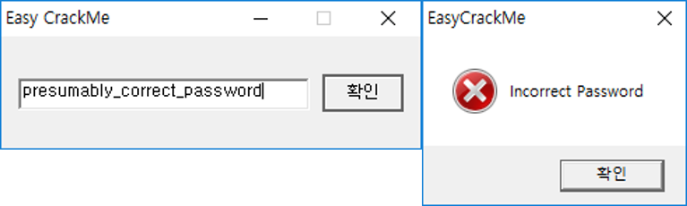

# Easy Crack

## 문제

- 첨부파일 : "Easy_CrackMe.exe", PE32 executable (GUI) Intel 80386, for MS Windows
- 목표 : 비밀번호 찾기
- 사용 도구 : OllyDbg v1.10



## 풀이


`Search For > All user referenced text strings`로 비밀번호 인증에 성공했을 때 나올법한 문자열을 찾아봤다. `0040111B`에서 `"Congratulation !!"` 이란 문자열을 사용하는 것을 확인해서 찾아갔다. 그 부분에서 비밀번호 확인 루틴이 있었는데, 여기서 비밀번호를 한땀한땀 찾으면 된다. 어떤 루틴의 시작부분을 찾을 때는 함수 프롤로그나 `NOP`가 겁나게 많은 부분을 찾으면 대부분 됐다. (이상한 바이너리도 많았다)

```assembly
00401094   |. 6A 64          PUSH 64                                         ; / Count = 64 (100.)
00401096   |. F3:AB          REP STOS DWORD PTR ES:[EDI]                     ; |
00401098   |. 66:AB          STOS WORD PTR ES:[EDI]                          ; |
0040109A   |. AA             STOS BYTE PTR ES:[EDI]                          ; |
0040109B   |. 8B7C24 70      MOV EDI,DWORD PTR SS:[ESP+70]                   ; |
0040109F   |. 8D4424 08      LEA EAX,DWORD PTR SS:[ESP+8]                    ; |
004010A3   |. 50             PUSH EAX                                        ; | Buffer
004010A4   |. 68 E8030000    PUSH 3E8                                        ; | ControlID = 3E8 (1000.)
004010A9   |. 57             PUSH EDI                                        ; | hWnd
004010AA   |. FF15 9C504000  CALL DWORD PTR DS:[<&USER32.GetDlgItemTextA>]   ; \ GetDlgItemTextA
```

`GetDlgItemText`로 입력받은 문자열을 가져오면 `DWORD PTR SS:[ESP+8]`부터 데이터가 쌓이게 된다...?

```assembly
004010B0   |. 807C24 05 61   CMP BYTE PTR SS:[ESP+5],61
004010B5   |. 75 7E          JNZ SHORT <Easy_Cra.Fail Point>
```

두번째 문자는 `a (61h)`가 되야한다!

```assembly
004010B7   |. 6A 02          PUSH 2
004010B9   |. 8D4C24 0A      LEA ECX,DWORD PTR SS:[ESP+A]
004010BD   |. 68 78604000    PUSH Easy_Cra.00406078                   ;  ASCII "5y"
004010C2   |. 51             PUSH ECX
004010C3   |. E8 88000000    CALL Easy_Cra.00401150
004010C8   |. 83C4 0C        ADD ESP,0C
004010CB   |. 85C0           TEST EAX,EAX
004010CD   |. 75 66          JNZ SHORT <Easy_Cra.Fail Point>

...

00401150   /$ 55             PUSH EBP

0040115D   |. 8B7D 08        MOV EDI,DWORD PTR SS:[EBP+8]
00401160   |. 8BF7           MOV ESI,EDI
00401162   |. 33C0           XOR EAX,EAX
00401164   |. F2:AE          REPNE SCAS BYTE PTR ES:[EDI]
00401166   |. F7D9           NEG ECX
00401168   |. 03CB           ADD ECX,EBX
0040116A   |. 8BFE           MOV EDI,ESI
0040116C   |. 8B75 0C        MOV ESI,DWORD PTR SS:[EBP+C]
0040116F   |. F3:A6          REPE CMPS BYTE PTR ES:[EDI],BYTE PTR DS:[ESI]
```

3번째, 4번째 문자는 `5y`가 되야한다.

```assembly
004010CF   |. 53             PUSH EBX
004010D0   |. 56             PUSH ESI
004010D1   |. BE 6C604000    MOV ESI,Easy_Cra.0040606C                       ;  ASCII "R3versing"
004010D6   |. 8D4424 10      LEA EAX,DWORD PTR SS:[ESP+10]
004010DA   |> 8A10           / MOV DL,BYTE PTR DS:[EAX]
004010DC   |. 8A1E           | MOV BL,BYTE PTR DS:[ESI]
004010DE   |. 8ACA           | MOV CL,DL
004010E0   |. 3AD3           | CMP DL,BL
004010E2   |. 75 1E          | JNZ SHORT Easy_Cra.00401102
004010E4   |. 84C9           | TEST CL,CL
004010E6   |. 74 16          | JE SHORT Easy_Cra.004010FE
004010E8   |. 8A50 01        | MOV DL,BYTE PTR DS:[EAX+1]
004010EB   |. 8A5E 01        | MOV BL,BYTE PTR DS:[ESI+1]
004010EE   |. 8ACA           | MOV CL,DL
004010F0   |. 3AD3           | CMP DL,BL
004010F2   |. 75 0E          | JNZ SHORT Easy_Cra.00401102
004010F4   |. 83C0 02        | ADD EAX,2
004010F7   |. 83C6 02        | ADD ESI,2
004010FA   |. 84C9           | TEST CL,CL
004010FC   |.^75 DC          \ JNZ SHORT Easy_Cra.004010DA
004010FE   |> 33C0           XOR EAX,EAX
00401100   |. EB 05          JMP SHORT Easy_Cra.00401107
00401102   |> 1BC0           SBB EAX,EAX
00401104   |. 83D8 FF        SBB EAX,-1
00401107   |> 5E             POP ESI
00401108   |. 5B             POP EBX
00401109   |. 85C0           TEST EAX,EAX
0040110B   |. 75 28          JNZ SHORT <Easy_Cra.Fail Point>
```

5번째 문자부터 끝날때 까지 반복하면서 `R3versing`과 비교를 한다.

```assembly
0040110D   |. 807C24 04 45   CMP BYTE PTR SS:[ESP+4],45
00401112   |. 75 21          JNZ SHORT <Easy_Cra.Fail Point>
```

1번째 문자는  `E (45h)`가 되야한다.

조합하면...? `Ea5yR3versing`!


