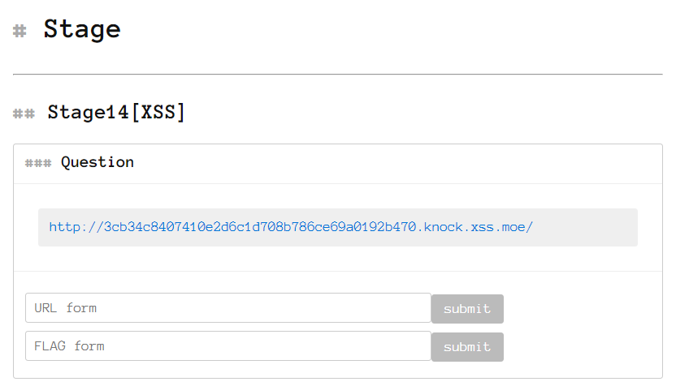

# XSS Thousand Knocks

이름 그대로 XSS 기법을 삽질해 볼수 있는 워게임

자기 하기 나름이기 때문에 여기 나온 풀이법은 문제 푼 후 참고용으로 쓰고, 그 전에는 읽어보지 말자.

그래도 안풀린다? 그럼 한 1달 뒤에 다시 돌아와서 풀어보는 걸 추천ㅋ

## 특징

`alert()`를 부르거나 문제 서버로 부터 직접적으로 데이터를 뽑아내는 문제 대신에, XSS 페이로드를 넣은 URL을 제작한 후 문제 서버가 거기에 접근했을 때 쿠키를 떨어트리도록 하는 것이 목적이다. 기존 XSS 문제와는 방식이 달라 처음 풀때 *어쩌라는 거지*라는 생각이 들 수도 있다.

## 문제 목록

- [Stage1](Stage1.md)
- [Stage2](Reflected-XSS.md)
- [Stage3](Reflected-XSS.md)
- [Stage4](Reflected-XSS.md)
- [Stage5](Reflected-XSS.md)
- [Stage6](Reflected-XSS.md)
- [Stage7](Reflected-XSS.md)
- [Stage8](Reflected-XSS.md)
- [Stage9](Reflected-XSS.md)
- [Stage10](Reflected-XSS.md)
- [Stage11](Reflected-XSS.md)
- [Stage12](CSP.md)
- [Stage13](X-XSS-Protection.md)
- [Stage14](CSP.md)