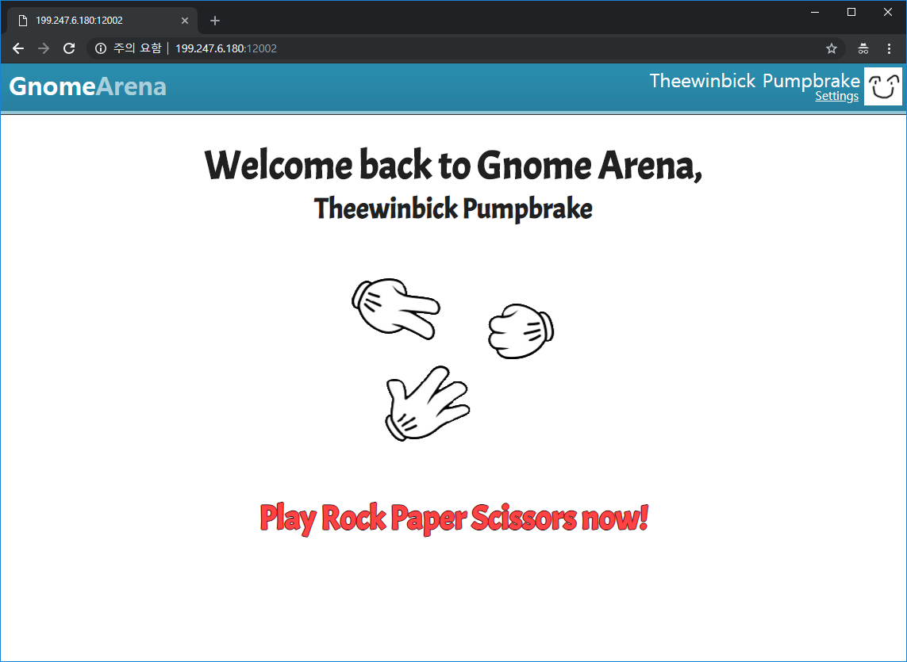

# GnomeArena: Rock Paper Scissors

## Challenge Description

50

This new website is all the rage for every gnome in Lapland! How many games of Rock Paper Scissors can you win?

Server: http://199.247.6.180:12002

Author: Milkdrop

## Solution

### How does it look?

This is the main page.

Basically you can play rock scissor paper with `rand()`. haha

And below is the settings page, we can go there by clicking `Settings` in main page.

### Where does vulnerability occurs?

The vunerability occurs in `settings.php`. We can upload webshell through avatar image.

Server receives image data through `Profile Image` section. Server determines whether it is valid image data, and saves it to `avatar/` directory with its filename to user's `Name`. 

To clarify, if we choose `Name` to `GnomeArenaWarrior`, uploaded profile picture will be saved in `avatar/GnomeArenaWarrior`.

Server does not check `Name` field value except `Quotes(')`, so if we choose `Name` to `blahblah.php` and upload PHP Image Webshell, we can access shell from `avatar/blahblah.php`.

So I set my `Name` to `this.php`, uploaded [Image Webshell](https://github.com/jgor/php-jpeg-shell) and accessed to `avatars/this.php`. I could extract flag from parent directory `flag.txt`.

## Thanks to

- Webhacking.kr
- https://github.com/jgor