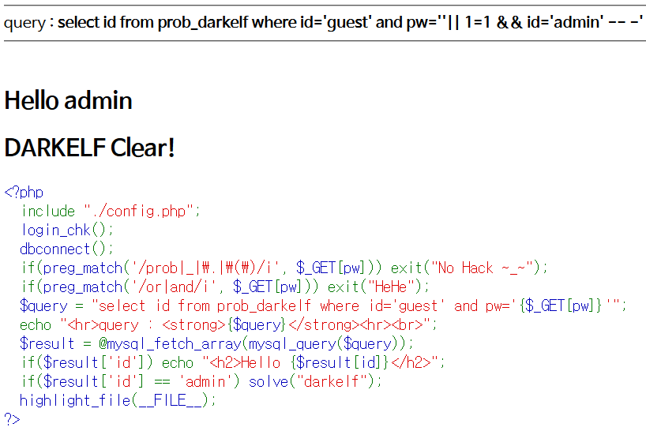

# Level 6 - Darkelf

## 문제


## 문제 의도

- php 소스를 읽을 줄 아는가?
- Or, And 연산자를 사용하지 않고 SQLi를 수행할 수 있는가?

## 코드 분석

```php
<?php
  include "./config.php";
  login_chk();
  dbconnect();
  if(preg_match('/prob|_|\.|\(\)/i', $_GET[pw])) exit("No Hack ~_~");
  if(preg_match('/or|and/i', $_GET[pw])) exit("HeHe");
  /* Or, And 연산자를 필터링했다. */
  $query = "select id from prob_darkelf where id='guest' and pw='{$_GET[pw]}'";
  echo "<hr>query : <strong>{$query}</strong><hr><br>";
  $result = @mysql_fetch_array(mysql_query($query));
  if($result['id']) echo "<h2>Hello {$result[id]}</h2>";
  if($result['id'] == 'admin') solve("darkelf");
  highlight_file(__FILE__);
?>
```

## 문제 풀이

or과 and 연산자도 공백과 마찬가지로 다른 걸로 대체할 수 있다. 나는 **||** 과 **&&** 를 사용했다. 사실 &를 문자 그대로 URL에 쓰면 GET으로 받는 pw 필드가 끝나기 때문에 &를 그대로 사용하면 안 되고, 아스키 코드로 변환해야지 문자 &로 인식된다. &는 아스키 코드 헥스 값 0x26이다. 그래서 GET으로 받는 pw 값을 **' || 1=1 %26%26 id='admin' -- -** 를 넣으면 필터링을 통과할 수 있다.

### 그 외에도 쓸수 있는 문자

추가예정

