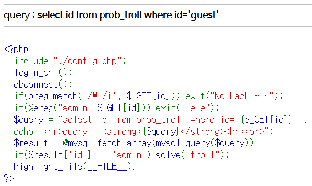

# Level 8 - Troll

## 문제



## 문제 의도

- php 소스를 읽을 줄 아는가?
- ereg() 함수의 취약점을 이용할 수 있는가?

## 코드 분석

```php
<?php
  include "./config.php";
  login_chk();
  dbconnect();
  if(preg_match('/\'/i', $_GET[id])) exit("No Hack ~_~");
  if(@ereg("admin",$_GET[id])) exit("HeHe");
  /* ereg() 함수는 윗줄의 preg_match()와 비슷한 기능을 하는 함수로,
    인자로 들어간 표현식을 통해 필터링하는 함수이다. 여기선 "admin"
    이란 문자를 GET으로 받은 id 필드에서 찾는데, 찾으면 필터링 해버린다.
    PHP 5.3.0부터 이 함수의 사용을 장려하지 않고 있다. */
  $query = "select id from prob_troll where id='{$_GET[id]}'";
  echo "<hr>query : <strong>{$query}</strong><hr><br>";
  $result = @mysql_fetch_array(mysql_query($query));
  if($result['id'] == 'admin') solve("troll");
  highlight_file(__FILE__);
?>
```

## 문제 풀이

코드 설명에도 쓴것 처럼, PHP 5.3.0부터는 ereg() 함수의 사용을 권장하지 않고 있다. ereg() 함수 외에도 eregi() 함수가 있는데, 이 둘의 차이는 대소문자를 구분하는가 마는가이다. eregi()함수는 문자열을 비교할때 대소문자를 구분하지 않지만, ereg() 함수는 대소문자를 다른 문자열로 구분한다. 이를 보완하기 위해 preg_match()라는 함수를 새로 만들어서, 함수에서 인자로 받는 표현식 안의 옵션 **('/i')** 에서 대소문자 구분 여부를 판별하게 되었다.

한마디로 ereg() 함수는 문자열의 대소문자 구분을 하기 때문에 "admin"과 "ADMIN"을 **다른 값으로** 인식하게 된다. SQL 인젝션에 대해 검색하면 한번쯤 봤을 것 같은데 SQL 구분 분석기는 쿼리에서 대소문자 구분을 **하지 않는다**. 그래서 id 필드에 'ADMIN'을 넣으면 ereg() 함수가 필터링 하지 않기 때문에 그대로 통과할 수 있다.

