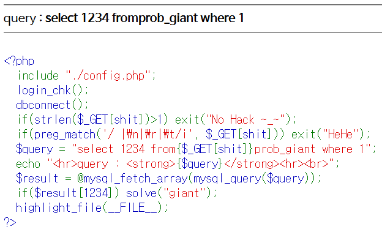
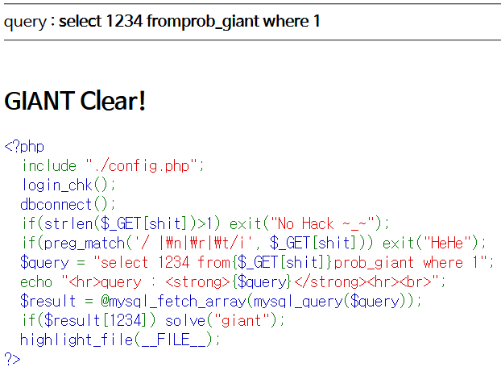

# Level 14 - Giant

## 문제



## 문제 의도

- php 소스를 읽을 줄 아는가?
- " ", "\n", "\r", "\t" 필터링을 우회할 수 있는가?

## 코드 분석

```php
<?php
  include "./config.php";
  login_chk();
  dbconnect();
  if(strlen($_GET[shit])>1) exit("No Hack ~_~");
  if(preg_match('/ |\n|\r|\t/i', $_GET[shit])) exit("HeHe");
  /* " "(공백), '\n', '\r', '\t'가 필터링 되었다. */
  $query = "select 1234 from{$_GET[shit]}prob_giant where 1";
  /* 현재 $query 에 담긴 쿼리는 올바르게 쿼리가 되지 않는데, 그 이유는
    GET으로 받은 shit 인자값이 없기 떄문에 from 과 prob 이 붙어 있어서
    유효한 쿼리가 아니기 때문이다. */
  echo "<hr>query : <strong>{$query}</strong><hr><br>";
  $result = @mysql_fetch_array(mysql_query($query));
  if($result[1234]) solve("giant");
  highlight_file(__FILE__);
?>
```

## 문제 풀이

6번째 코드를 보면 from과 prob_giant 사이가 띄어지지 않는 한 쿼리가 정상적으로 먹히지 않을 것 같다. 그런데 GET으로 받는 shit 인자에서 공백과 이스케이프 문자 '\n', '\t', '\r'등이 필터링 되었다. 전에 공백을 필터링 했던 문제의 경우 공백을 대신할 수 있는 문자를 넣으면 됐는데 지금은 이마저 필터링 되었으니 어떻게 할까... 생각할 수도 있는데 사실 필터링 되지 않은 공백 역할을 할 수 있는 문자가 남아 있다. 필터링된 문자들과 10진수 코드와 비교하면 다음과 같다
> '\t' (Tab) = 9 = 0x09
>
> '\n' (Line Feed) = 10 = 0x0A
>
> '\r' (Carriage Return) = 13 = 0x0D
>
> ' ' (공백) = 32 = 0x20

그래서 이들을 제외한 필터링 되지 않은 문자들에는 다음이 있다.
> Vertical Tab = 11 = 0x0B
>
> New Page = 12 = 0x0C

shit 인자에 0x0B나 0x0C와 같은 문자를 넣으면 공백으로 인식해 정상적인 쿼리처럼 된다. (근데 왜 하필 이름이 shit 였을까)


