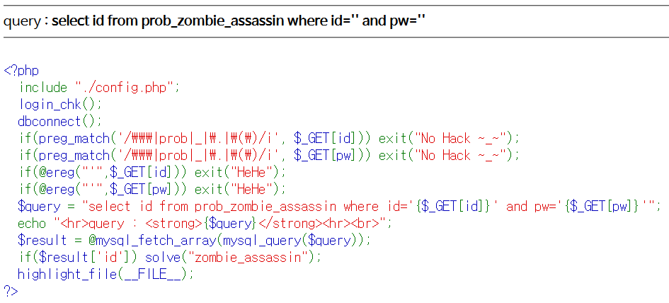

# Level 16 - Zombie Assassin

## 문제



## 문제 의도

- php 소스를 읽을 줄 아는가?
- ereg() 함수의 취약점을 이용할 수 있는가?

## 코드 분석

```php
<?php
  include "./config.php";
  login_chk();
  dbconnect();
  if(preg_match('/\\\|prob|_|\.|\(\)/i', $_GET[id])) exit("No Hack ~_~");
  if(preg_match('/\\\|prob|_|\.|\(\)/i', $_GET[pw])) exit("No Hack ~_~");
  // GET으로 받는 ID와 PW값에 \, prob, ., (, )들이갈때 필터링 한다.
  if(@ereg("'",$_GET[id])) exit("HeHe");
  if(@ereg("'",$_GET[pw])) exit("HeHe");
  // GET으로 받는 ID와 PW값에 ' (Single Quote)가 있으면 필터링한다.
  $query = "select id from prob_zombie_assassin where id='{$_GET[id]}' and pw='{$_GET[pw]}'";
  echo "<hr>query : <strong>{$query}</strong><hr><br>";
  $result = @mysql_fetch_array(mysql_query($query));
  if($result['id']) solve("zombie_assassin");
  highlight_file(__FILE__);
?>
```

## 문제 풀이

이 문제는 admin, guest 상관없이 쿼리를 통해 결과를 받기만 하면 되는 문제이다.

8번 Troll 문제에서도 **ereg()** 함수가 대소문자를 구별한다는 점을 사용해 문제를 해결했는데, 이 문제도 ereg() 함수의 취약한 부분을 사용하면 된다. ereg()함수가 인자로 받은 패턴을 문자열에서 검색할때 문자열의 끝을 나타내는 `NULL(%00)` 을 만나면 탐색을 끝낸다고 한다. 그말은 문자열 앞에 NULL만 붙혀도 함수가 탐색을 못한다는 뜻이다.

ereg() 함수에게 필터링 되는 ' (Single Quote) 앞에 %00 (NULL) 문자를 붙히면 ereg() 함수가 찾지 못하고 필터링을 통과하게 된다. 그래서 GET으로 주는 id나 pw 필드에 `-1%00' or 1=1-- -` 을 넣으면 간단하게 WHERE 문을 우회할 수 있다.

