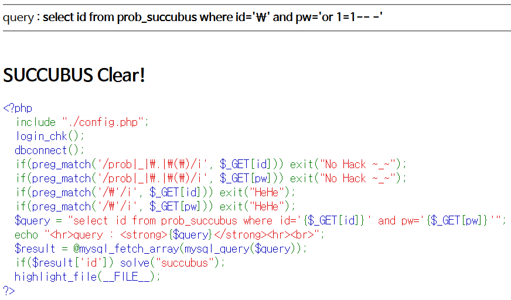

# Level 17 - Succubus

## 문제


## 문제 의도

- php 소스를 읽을 줄 아는가?
- 이스케이프 문자를 사용해 쿼리를 변조할 수 있는가?

## 코드 분석

```php
<?php
  include "./config.php";
  login_chk();
  dbconnect();
  if(preg_match('/prob|_|\.|\(\)/i', $_GET[id])) exit("No Hack ~_~");
  if(preg_match('/prob|_|\.|\(\)/i', $_GET[pw])) exit("No Hack ~_~");
  if(preg_match('/\'/i', $_GET[id])) exit("HeHe");
  if(preg_match('/\'/i', $_GET[pw])) exit("HeHe");
  $query = "select id from prob_succubus where id='{$_GET[id]}' and pw='{$_GET[pw]}'";
  echo "<hr>query : <strong>{$query}</strong><hr><br>";
  $result = @mysql_fetch_array(mysql_query($query));
  if($result['id']) solve("succubus");
  highlight_file(__FILE__);
?>
```

## 문제 풀이

4번 5번 코드만 봐도 전 문제랑 비슷해 보이는데 ereg() 함수가 사라진게 보인다. 전 문제랑 같은데 ereg()가 사라지고 preg_match()를 사용하니 어떻게 해야되지 고민했는데 눈 비비고 잘 보니 전 문제랑 필터링하는 문자가 좀 달랐다.

```php
// Zombie Assassin
if(preg_match('/\\\|prob|_|\.|\(\)/i', $_GET[pw])) exit("No Hack ~_~");
// Succubus
if(preg_match('/prob|_|\.|\(\)/i', $_GET[id])) exit("No Hack ~_~");
```

딱 봐도 `\` 문자 필터링이 사라진걸 볼수 있다. 눈치가 빠르다면 이 문제는 `\` 문자를 사용하는 문제임을 알수 있다. `\`는 이스케이프 문자로 특수문자들을 표현할때 앞에 넣기로 유명하다. 만약 ' (Single Quote) 앞에 이스케이프 문자를 넣으면 ' 는 문자열의 끝이 아닌 문자로 인식되게 된다.
이를 이용해 id 필드에 `\`를 넣게 되면 ' 가 문자로 인식되게 되며 그 뒤에 있는 다른 ' 가 나오기 전까지 데이터가 합쳐저 `'\' and pw='` 라는 문자열이 되게 된다.그러면 pw 필드에 넣는 값이 ' 를 탈출하게 되는데, 여기서 `or 1=1`을 넣어서 WHERE 문을 무력화 시키면 된다.

