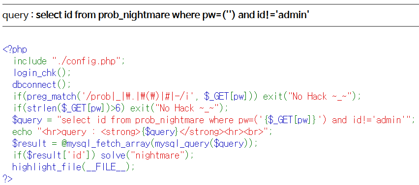
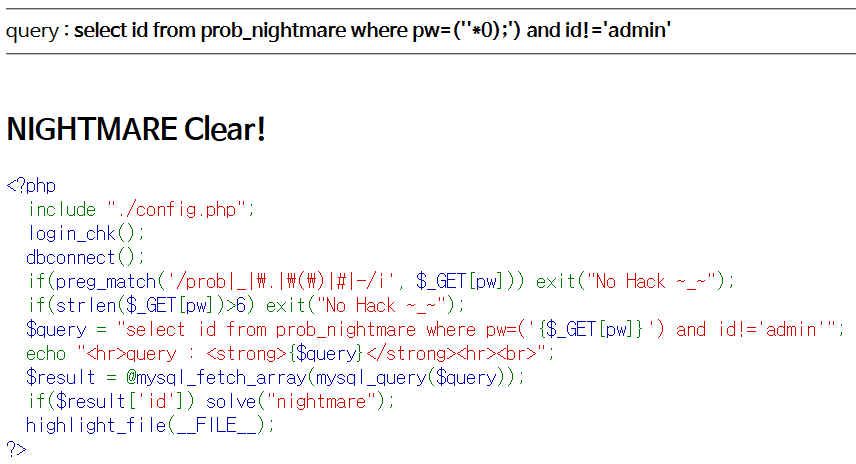

# Level 18 - Nightmare

## 문제



## 문제 의도

- php 소스를 읽을 줄 아는가?
- False SQL Injection을 수행할 수 있는가?

## 코드 분석

```php
<?php
  include "./config.php";
  login_chk();
  dbconnect();
  if(preg_match('/prob|_|\.|\(\)|#|-/i', $_GET[pw])) exit("No Hack ~_~");
  // #이나 -를 필터링해 코멘트 처리를 필터링 했다.
  if(strlen($_GET[pw])>6) exit("No Hack ~_~");
  // GET으로 받은 pw 필드 길이가 7 이상이면 필터링된다.
  // 한마디로 사용할수 있는 문자는 6자 밖에 안된다.
  $query = "select id from prob_nightmare where pw=('{$_GET[pw]}') and id!='admin'";
  // GET으로 받은 pw 필드를 괄호로 감싼다.
  echo "<hr>query : <strong>{$query}</strong><hr><br>";
  $result = @mysql_fetch_array(mysql_query($query));
  if($result['id']) solve("nightmare");
  highlight_file(__FILE__);
?>
```

## 문제 풀이

솔직히 pw 필드가 6자로 제한되어 있어서 브루트 포싱하면 되지 않겠냐고 생각했는데 어리석은 생각이었다. 이 문제는 괄호가 있다는 점을 어째저째 이용하면 된다. SQL 인젝션에 검색하다보니 **False SQL Injection** 기법이 있다는 걸 볼 수 있었는데, 솔직히 뭔진 잘 모르겠는데 각 요소를 비교할때 True(1), False(0)를 넣으면 정상적으로 처리된다는 것 같다.

현재 우라기 입력할 수 있는건 pw 필드이고 pw는 `pw=('{$_GET[pw]}')`로 감싸져 있다. 이 괄호를 이용해 ')로 괄호를 닫고, 거기에 *0을 하면 ('')*0 은 0이니까 pw 필드에 문자열이 아닌 False(0) 값이 들어가게 된다! 그리고 ;%00으로 뒤 문장을 주석처리 해주면 정상적인 쿼리가 된다.



## Reference (생명의 은인)

- [hi.pe.kr 날으는물고기 :: False SQL Injection and Advanced Blind SQL Injection](http://blog.pages.kr/1237)
